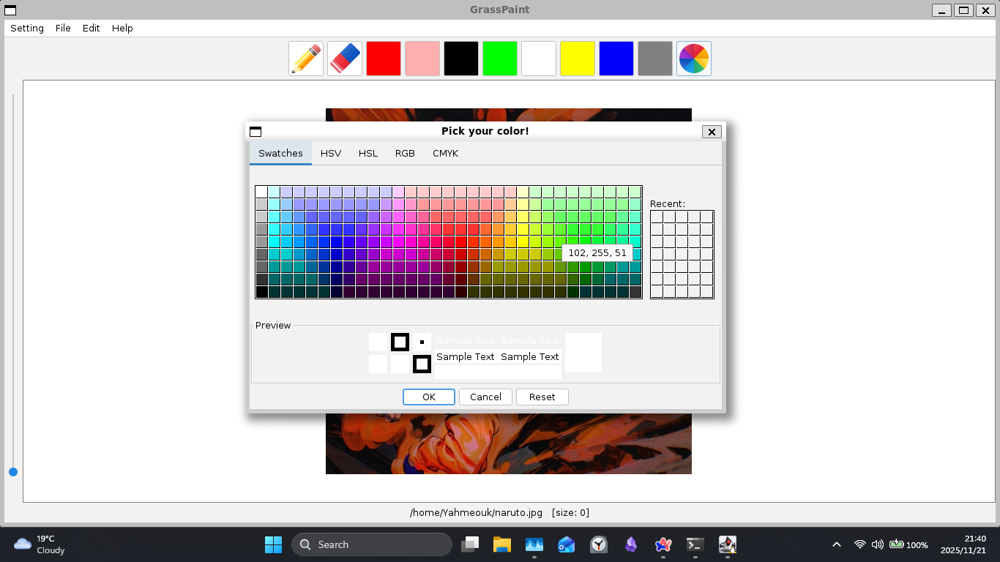
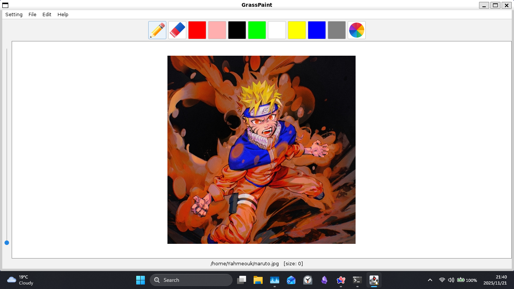
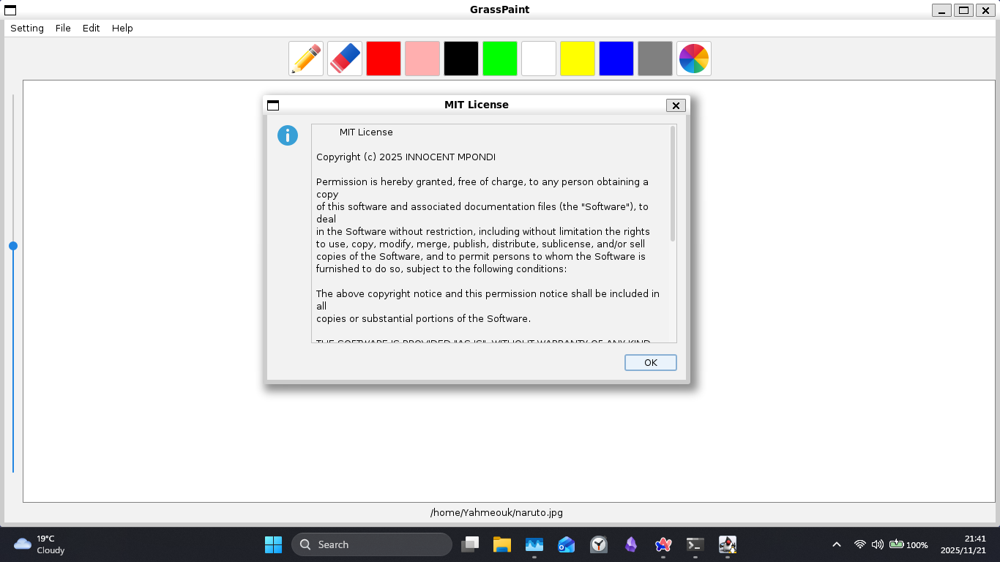

# GrassPaint (Touch some grass by drawing some grass)

[](https://www.google.com/search?q=https://github.com/INNOCENT-ops806/GrassPaint/releases/tag/v1.0.0)

> [\!NOTE]
> The project is a work in progress so anything might change at any time.

## Description

GrassPaint is a cross-platform drawing application built on Java Swing, designed for users who prioritize **keyboard-centric workflows** and speed.

I initially had the idea for this software after buying a drawing tablet and feeling constrained by the limited and rigid shortcuts in existing applications. While GrassPaint doesn't implement Vim's modal editing, it is engineered to offer a high degree of **shortcut customization** and key bindings to boost your drawing efficiency.

## Key Features (v0.9.0-Beta)

This current release includes the essential features for the core drawing engine:

- **Persistent History:** Reliable Undo/Redo stack for managing drawing actions.
- **Canvas Control:** Resizable drawing canvas and dynamic resizing upon image loading.
- **Refined UI Feedback:** The thickness slider value is only displayed while the slider is actively being dragged.
- **Core Tools:** Pencil, Eraser (with dynamic background matching), Color Picker, and color presets.
- **I/O:** Load and save artwork as PNG files(currently you have to specify the extension but in future releases they will be automatically appended).

## Shortcuts 
- `<C-o>` ->  Open a file
- `<C-s>` ->  Save file
- `<C-u>` ->  Undo action
- `<C-r>` ->  Redo action
- `<C-c>` ->  Exit application
- `<C-l>` ->  View License

- Alt + p ->  Toggle pencil
- Alt + e ->  Toggle eraser

## Usage

### Prerequisites

You must have **Java Development Kit (JDK) 17 or newer** installed to compile and run GrassPaint.

### Installation

```sh
git clone https://github.com/INNOCENT-ops806/GrassPaint.git
cd GrassPaint
```

### Running the Application

You have two options to run the project:

#### A. Build and Run from Source (Recommended)

Run the `run.sh` script, which handles compilation and packaging.

```sh
# Ensure the script is executable and run it
chmod +x run.sh
./run.sh
```

#### B. Download the JAR File

Download the executable `.jar` file from the latest release on GitHub: [Releases](https://github.com/INNOCENT-ops806/GrassPaint/releases/)

To run the JAR file:

```sh
java -jar /path/to/GrassPaint-v0.9.0-beta.jar
```

## Screenshots

### GrassPaintV0.9.0


### Picking a color



### Opening an image



### License dialog



## Reporting Bugs & Feedback (Beta)

If you find a bug, please open an Issue on this repository or send a detailed email. Your reports are essential for the v1.0 stable release\!

**When reporting an issue, please include:**

1. Operating System (e.g., Windows 10, Kali/WSL2).
2. Your Java Version (`java -version`).
3. The exact steps required to reproduce the issue.

## Libraries and Credits

### Libraries

- **Core Technology:** Java Swing (Standard Desktop GUI Library).
- **Look and Feel:** [FlatLaf](https://www.formdev.com/flatlaf/) (Provides the modern, dark/light theme options).

### Credits

- Inspired by the ideas and structure of: [swing-paint-application](https://github.com/haxxorsid/swing-paint-application)
